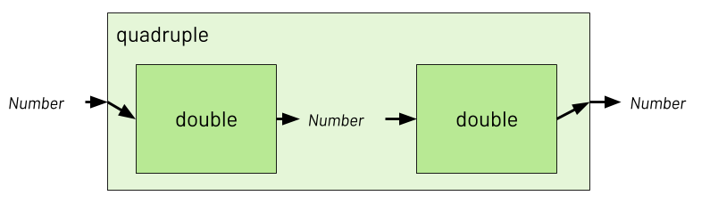
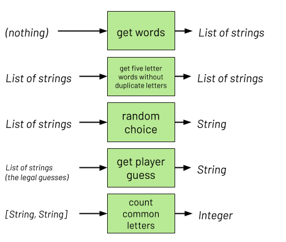
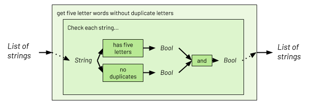

# Types Lab

replace links to isf repo <br>
fix modulo link (functions lesson in unit 0)


In the [functional programming lab](), we started 
focusing on how functions transform their inputs into outputs. Let's visualize
this:


We're not so focused on how the function gets its work done as we are on what
goes in and what comes out. This unlocks a powerful new way of breaking down
problems: we can think about how functions could be connected together. How do
you quadruple a number? Just double it, and then double the result: 



This might not seem like a very big deal. It's too easy. But you will soon see
that much more difficult problems can often be broken down into simpler
functions by thinking about how each function transforms an input into an
output.

## Part 1: Thinking about types

But how can we talk precisely about what goes in to functions and what comes
out? You have already met a bunch of different kinds of objects in Python: `1`,
`2.55`, `True`, `"avuncular"`, `None`. Each of these has a **type**. When we
talk about what goes in to functions and what comes out, we won't talk about
particular inputs (who cares if you double `7` or `9`? The point is you can't
double `False`). We'll talk about the **types** of objects that functions
operate on. Everything has a type. Here are a few types that you already know:

| Type     | Examples        | Description                                                                                                                          |
| -------- | --------------- | ------------------------------------------------------------------------------------------------------------------------------------ |
| `int`    | 145, -200       | Integers, just like you know them from math class :)                                                                                 |
| `float`  | 1.1115, 9.08    | Decimal numbers. They're called `float` because of [how they are stored](https://en.wikipedia.org/wiki/Floating-point_arithmetic)    |
| `str`    | "apple", "x"    | Strings, or sequences of characters. Careful! `5` is an `int` but `"5"` is a `str`.                                                  |
| `bool`   | `True`, `False` | Booleans, or True/False values. Named for George Boole, who spent a lot of time thinking about them.                                 |
| `list`   | `[1, 2, 3]`     | A `list` holds other objects.                                                                                                        |

FYI, every type is also a function which turns its argument into that type, if
it's possible. So `int(3.33333)` becomes `3`, `str(True)` becomes `"True"`, and
`bool(0)` becomes `False`. But `list(False)` is an error, because there's no
sensible way to turn `False` into a list. 
Python's attitude toward types is pretty casual; even if
something is not quite the right type, we'll make it work if we can. Other
languages are *much* stricter, requiring every variable to specify its type, and
requiring every function to specify what type it accepts and what type it
returns. There are tradeoffs, and you'll probably develop an opinion on which
you prefer once you learn a few more programming languages. 

 **Work with your table to fill in the following table. For each function describe what type the function would take as an input, and what type the function would return as output.**

| Function                                                         | Input type(s) | Output type |
|------------------------------------------------------------------|---------------|-------------|
| Square root of a number                                          | float         | float       |
| Multiplication of two integers                                   |               |             |
| Average of a list of numbers                                     |               |             |
| A function that gives all the factors of a number                |               |             |
| A function to check if a word is a curse word                    |               |             |
| A function that assigns a friendliness score to a sentence       |               |             |
| A function that takes a website URL and returns the page content |               |             |
| A function that counts the number of sentences in a paragraph    |               |             |
| `>`                                                              |               |             |
| `not`                                                            |               |             |

You may either write this table on paper, or copy it into a document on your computer. You won't turn this in. Once you are confident in your answers (and confident everyone in your group can explain them) check with a teacher.

## Part 2: Jotto

In this part, you are going to program a word game called [Jotto](https://en.wikipedia.org/wiki/Jotto), where
the goal is to guess a secret five-letter word. Each time the player guesses, they will be told
how many of the letters are correct (even if they're not in the right place).




For this lab, use the following link to create a repo for your lab work. This will be a group assignment, so you will form a team with your table group and share one Github repository.

If you are in **CS 1**, [click here](https://classroom.github.com/a/r13vhXjj).

If you are in **CS 2**, [click here](https://classroom.github.com/a/C8pBPH32).

💻 **Clone the lab repo into your `unit_01` directory and `cd` inside.**

This lab will probably be the first time you use Github as a team. The basic workflow is still the same, with one slight change:

+ `git pull` to get any new changes from the Github repo
+ `git status` to determine what has change
+ `git add` to add the files you've edited
+ `git commit` to write a message about what you've changed
+ `git push` to push your changes to Github

Because multiple people will be working on the same project, you will not be the only one changing the project. This means that sometimes there will be code on Github which you do not have in your local repository.

When you begin working on a project after taking a break and before you begin the workflow above, use git pull to pull any new changes from Github to your local repository.

💻 **Have one member of your group make a change to the helper_functions.py file and then make sure everyone can get the changes in their local repositories**

If you've already got code written, this will merge your code with code your teammates put on GitHub. Sometimes, changes to your teammates' code will conflict with the changes you made. In this case, you'll need to use Atom to select which changes you want to use.

You will likely run into this over the course of this lab. Try it out on your own, and let the teaching team know if you get stuck.






The game itself is in `lab_01_01.py`, and is coded in just a dozen lines. The reason this is so short is that it relies on some powerful helper functions defined in `helper_functions.py`. This is where you come in! It's your job to complete these helper functions. Once you complete them, `lab_01_01.py` should work. If you think about Jotto the way you thought about programs in the first unit, you might describe it like this:

```
To play Jotto:
    Get the 10,000 most common English words. 
    Filter all the words to find legal words (five letters, no duplicates)
    Choose one legal word as the secret word.
    Ask the player to guess a word. 
    Until the guess equals the secret word:
        Tell the player how many letters the guessed word shares with the secret word.
        Ask the player to guess another word. 
    Congratulate the player.
```

Actually, this almost exactly matches the code in `lab_01_01.py`. If we think about this in 
functional terms, we can see that we really just need to write a few functions:



And the trickiest function, `get_five_letter_words_without_duplicate_letters`,
could be broken down even more, using two more functions: 
        



💻 **Collaborate with each member of your group to write each function in `helper_functions.py`. Once your group has come to a consensus on a function and tested your solution, one member will push their code to Github. Then, everyone else can use git pull to get the code in your local lab directory.**

Also provided is `test_helper_functions.py`, which runs automated tests on your helper functions. Don't bother running `lab_01_01.py` until all these tests pass.






This game requires a list of words. We could copy and paste them into our Python file, but the word list contains the 10,000 most common English words. That would create a huge mess. A much better idea is to keep our data in a separate file, and to read it as part of our Python program.

There are a lot of different ways to read files, but one thing to keep in mind is that just about all the data files we will use in class are just plain text.

In this lab, we use an object called `Path` from [pathlib](https://docs.python.org/3/library/pathlib.html), which represents a file system path (something like "~/Desktop/cs9/unit_01/") Paths can point to files or directories. `Path` objects can do all kinds of neat tricks, like moving files, copying them, checking what they contain, and reading their contents. In this lab, you are given the following function:

```python
from pathlib import Path

    def get_words():
    filename = "10k_english_words.txt"
    return Path(filename).read_text().split()
```

It just reads the contents of the file "10k_english_words.txt" as a really long string, and then splits it into separate strings. Try opening "10k_english_words.txt" in Atom and you'll see it's just a text file with one word per line.






One common use of functions in functional programming is to transform each item in a list into something else. For example, if we have the following super-annoying function, we might want to use it to transform a whole lot of messages.

```python
def make_enthusiastic(message):
    return "{}!!!".format(message)
```

We can use the following structure, called a list comprehension. (Note: There's a [video about lists](https://vimeo.com/367070978) that explains these ideas.)

```shell
>>> boring_messages = ["hello", "so bored", "why am I here"]
  >>> [make_enthusiastic(message) for message in boring_messages]
  ["hello!!!", "so bored!!!", "why am I here!!!"]
```

In English, this says: replace each `message` in `boring_messages` with `make_enthusiastic(message)`. By the way, message is just a variable name. It would work the same with a different name:

```shell
>>> boring_messages = ["hello", "so bored", "why am I here"]
  >>> [make_enthusiastic(m) for m in boring_messages]
  ["hello!!!", "so bored!!!", "why am I here!!!"]
```

You can also use list comprehensions to filter out items from a list. If we have the following function (remember [modulo]()?)

```python
def is_even(number):
  return number % 2 == 0
```

then we can get just the even numbers in a list:

```shell
>>> numbers = [1,2,3,4,5,6,7,8,9]
  >>> [n for n in numbers if is_even(n)]
  [2,4,6,8]
```

Again, practice reading this in English: Keep each `n` in `numbers` if it's even. Finally, you can write list comprehensions which transform and filter at the same time:

```shell
>>> [make_enthusiastic(n) for n in range(10) if not is_even(n)]
```

🔮 **Can you predict what the result will be?**


